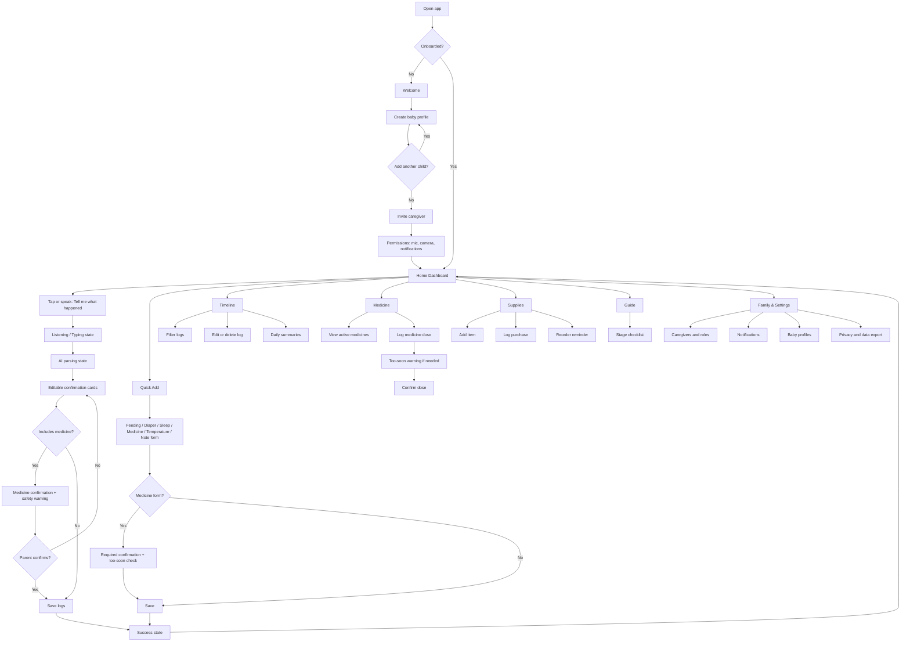

# Nurture Assistant mobile-first UX flow

Nurture Assistant is a calm, fast baby-care tracking assistant for tired caregivers. The product is optimized for one-handed use, low cognitive load, and safety-critical confirmation, especially for medicine logs.

## Product principles

- **Talk first, tap second:** the primary action is a voice-style text input where parents can say what happened in natural language.
- **Confirmation before commitment:** parsed logs are shown as editable cards before saving. Medicine always requires explicit confirmation.
- **One hand, one glance:** primary controls sit in the thumb zone, cards are large, and status text is short.
- **Warm but clinical when needed:** the interface feels soft and supportive, while medicine safety uses clear contrast and direct language.
- **Caregiver clarity:** every care log is attached to the correct baby, time, and caregiver.

## Primary personas and contexts

### Tired parent at night
- Holding an infant, using one hand.
- Needs to record feeding or medicine quickly.
- Wants reassurance that the app understood correctly.

### Shared caregiver household
- Multiple adults may log care.
- Needs child selection, caregiver attribution, and reminders.
- Needs permission and role boundaries.

### New parent preparing supplies
- Wants simple checklists and inventory reminders.
- Needs practical guidance without feeling overwhelmed.

## Navigation structure

Bottom navigation is persistent after onboarding:

1. **Home**
   - Assistant input
   - Quick Add
   - status cards
   - reminders
   - timeline preview
2. **Timeline**
   - daily care history
   - filters
   - edit/delete
   - summaries
3. **Medicine**
   - medicine-specific dashboard
   - active medicines
   - log dose
   - safety warnings
4. **Supplies**
   - inventory
   - days-left estimates
   - reorder reminders
5. **Guide**
   - stage-based checklists
   - essential preparation categories

Family & Settings is available from the Home header profile/settings button rather than the bottom nav to keep the bottom nav focused on daily care.

## User flow map



## Onboarding flow

### 1. Welcome
Goal: explain the promise without a feature dump.

Content:
- Headline: "Baby care tracking that feels like talking."
- Subtext: "Log feeds, diapers, sleep, medicine, and supplies in seconds."
- Primary CTA: "Create baby profile"
- Secondary CTA: "I already have an invite"

UX notes:
- Use one short illustration or icon cluster.
- Keep account creation deferred if possible; ask only for essentials first.

### 2. Create baby profile
Essential fields:
- Baby name
- Date of birth or due date
- Optional photo/avatar
- Feeding preference: formula, breast milk, mixed, solids, not sure

Actions:
- Primary: "Continue"
- Secondary: "Skip photo"

### 3. Add another child
Prompt:
- "Do you track care for another child?"

Actions:
- "Add another child"
- "Not now"

### 4. Invite caregiver
Fields:
- Phone or email
- Role: parent, grandparent, helper, view-only

Helper copy:
- "Caregivers can log care and see updates based on their role."

### 5. Permission prompts
Prompt permissions only after explaining value:

- Microphone: "Use voice to log care hands-free."
- Camera: "Scan supply labels or add baby profile photos."
- Notifications: "Get medicine, feeding, and reorder reminders."

Pattern:
- In-app education card first.
- Native OS permission prompt only after user taps "Allow".
- Provide "Not now" on every permission.

## Home Dashboard

### Layout

```
┌──────────────────────────────┐
│ Emma ▼            ⚙ / family │
│ Good evening, Maya           │
│ Last updated by Dad · 7:52pm │
├──────────────────────────────┤
│ Tell me what happened        │
│ [ mic ] Emma drank...        │
├──────────────────────────────┤
│ Quick Add                    │
│ Feed Diaper Sleep            │
│ Med  Temp   Note             │
├──────────────────────────────┤
│ Status cards                 │
│ Last fed       Last diaper   │
│ 8:00pm 90ml    7:40pm wet    │
│ Last sleep     Last medicine │
│ 45m nap        8:00pm        │
├──────────────────────────────┤
│ Upcoming reminders           │
│ Fever medicine · check 12am  │
├──────────────────────────────┤
│ Today preview                │
│ 8:00p Feed + Medicine        │
│ 7:40p Diaper                 │
└──────────────────────────────┘
```

### Key components

- **Baby selector:** top-left chip with avatar, name, and dropdown.
- **Greeting:** time-aware and caregiver-aware.
- **Primary assistant input:** large rounded card, supports tap-to-type and press-to-talk.
- **Quick Add buttons:** two rows of large pill buttons with icons.
- **Status cards:** 2-column grid with last care facts.
- **Upcoming reminders:** one card, max 2 visible reminders.
- **Timeline preview:** latest 3 logs with "View all".

## AI Logging Flow

Example input:

> "Emma drank 90ml formula at 8pm and I gave 2.5ml fever medicine."

### State 1: Listening or typing

```
┌──────────────────────────────┐
│ Tell me what happened        │
│                              │
│ "Emma drank 90ml..."         │
│                              │
│  ● Listening...              │
│ [Cancel]            [Review] │
└──────────────────────────────┘
```

Requirements:
- Show live transcript while listening.
- Allow correction before parsing.
- Provide manual fallback if mic is unavailable.

### State 2: AI parsing

```
┌──────────────────────────────┐
│ Understanding your update... │
│                              │
│ Found possible feeding and   │
│ medicine logs.               │
└──────────────────────────────┘
```

UX notes:
- Keep this state short and reassuring.
- Do not save in this state.

### State 3: Editable confirmation cards

```
┌──────────────────────────────┐
│ Review before saving         │
├──────────────────────────────┤
│ Feeding                      │
│ Baby: Emma                   │
│ Type: Formula                │
│ Amount: 90 ml                │
│ Time: 8:00pm                 │
│ [Edit]                       │
├──────────────────────────────┤
│ Medicine                     │
│ Baby: Emma                   │
│ Medicine: Fever medicine     │
│ Dose: 2.5 ml                 │
│ Time: 8:00pm                 │
│ [Edit]                       │
├──────────────────────────────┤
│ ⚠ Confirm medicine details   │
│ Check name, dose, time, and  │
│ child before saving.         │
│ [ ] I checked this dose      │
│ [Save 2 logs]                │
└──────────────────────────────┘
```

Medicine rule:
- If any parsed item is medicine, the save button remains disabled until the caregiver confirms the medicine details.
- Medicine cards must be visually distinct with an amber safety accent.
- A medicine entry cannot be auto-saved from AI parsing.

### State 4: Save success

```
┌──────────────────────────────┐
│ Saved                        │
│ Feeding and medicine logged  │
│ for Emma at 8:00pm.          │
│ [Add another] [Back home]    │
└──────────────────────────────┘
```

## Quick Add Flow

Shared form pattern:
- Baby
- Type
- Amount or dose where relevant
- Time
- Notes
- Save button

Use defaults:
- Baby defaults to currently selected baby.
- Time defaults to now.
- Type defaults to the last-used type for that baby.
- Notes are collapsed or placed last.

### Feeding form

Fields:
- Baby
- Type: formula, breast milk, nursing, solids, water/other
- Amount: ml or oz when applicable
- Side/duration for nursing if selected
- Time
- Notes
- Save feeding

### Diaper form

Fields:
- Baby
- Type: wet, dirty, mixed, dry
- Time
- Notes
- Save diaper

### Sleep form

Fields:
- Baby
- Type: nap, nighttime
- Start time
- End time or "still sleeping"
- Notes
- Save sleep

### Medicine form

Fields:
- Baby
- Medicine name
- Dose
- Unit: ml, drops, tablet, other
- Time
- Notes
- Confirmation checkbox: "I checked the medicine, dose, time, and child."
- Save medicine

Safety behavior:
- Run a too-soon check against last logged dose for the same baby and medicine.
- If too soon, show an interruptive warning and require explicit "Save anyway" confirmation.
- Show safety note: "BabyCopilot tracks medicine but does not provide medical advice."

### Temperature form

Fields:
- Baby
- Temperature
- Unit: F or C
- Method: rectal, forehead, ear, armpit, oral, other
- Time
- Notes
- Save temperature

### Note form

Fields:
- Baby
- Type: general, symptom, milestone, question for doctor
- Time
- Notes
- Save note

## Timeline

### Layout

```
┌──────────────────────────────┐
│ Today, May 31                │
│ [Emma ▼]                     │
├──────────────────────────────┤
│ Summary                      │
│ 4 feeds · 6 diapers · 2 naps │
│ 1 medicine · 1 temperature   │
├──────────────────────────────┤
│ Filters                      │
│ All Feed Diaper Sleep Med... │
├──────────────────────────────┤
│ 8:00pm                       │
│ Formula 90ml                 │
│ Fever medicine 2.5ml         │
│ [Edit] [Delete]              │
│                              │
│ 7:40pm Wet diaper            │
└──────────────────────────────┘
```

Features:
- Date picker with Today shortcut.
- Horizontal filter chips: feeding, diaper, sleep, medicine, temperature, note.
- Group logs by time.
- Edit/delete actions in an overflow or expanded row.
- Daily summary cards at the top.

Deletion:
- Use a confirmation sheet: "Delete this log?"
- For medicine, include dose and time in the confirmation copy.

## Medicine

### Dashboard

```
┌──────────────────────────────┐
│ Medicine                     │
│ Safety-first tracking        │
├──────────────────────────────┤
│ Active medicines             │
│ Fever medicine               │
│ Last: 8:00pm · Emma          │
│ Next reminder: 12:00am       │
│ [Log dose]                   │
├──────────────────────────────┤
│ Add medicine manually        │
│ Name, dose guidance label,   │
│ optional reminder interval   │
├──────────────────────────────┤
│ Safety note                  │
│ BabyCopilot tracks           │
│ medicine but does not        │
│ provide medical advice.      │
└──────────────────────────────┘
```

Required content:
- Active medicines
- Last given
- Next reminder
- Add medicine manually
- Log medicine dose
- Too-soon warning
- Safety note: "BabyCopilot tracks medicine but does not provide medical advice."

Product naming note:
- The broader app is named Nurture Assistant. The exact requested safety note above uses "BabyCopilot"; align this name before production copy is finalized.

### Too-soon warning

```
⚠ This dose may be too soon.
Fever medicine was last logged for Emma at 8:00pm.
Check the label or contact a clinician before giving more.

[Review details] [Save anyway]
```

Behavior:
- Warning blocks the default save path.
- "Save anyway" requires a second tap or checkbox.
- Log retains warning metadata for auditability.

## Supplies

### Dashboard

```
┌──────────────────────────────┐
│ Supplies                     │
│ Essentials at a glance       │
├──────────────────────────────┤
│ Diapers                      │
│ 42 left · about 6 days       │
│ Reorder at 20                │
├──────────────────────────────┤
│ Formula                      │
│ 1.5 cans · about 5 days      │
│ Reminder: buy tomorrow       │
├──────────────────────────────┤
│ Wipes, medicine, other       │
├──────────────────────────────┤
│ [Add supply item]            │
│ [Log purchase]               │
└──────────────────────────────┘
```

Track:
- Diapers
- Formula
- Wipes
- Medicine
- Other essentials

Each supply item:
- Current stock
- Estimated days left
- Reorder reminder
- Purchase history
- Optional preferred store/link placeholder

## Guide

Stage tabs:
- Before delivery
- 0-3 months
- 3-6 months
- 6-12 months

Checklist groups:

### Before delivery
- Hospital bag
- Car seat installed
- Feeding essentials
- Diapering station
- Medicine cabinet basics
- Caregiver plan

### 0-3 months
- Newborn feeding rhythm
- Diaper output tracking
- Safe sleep setup
- Pediatrician visit prep
- Temperature and medicine safety basics

### 3-6 months
- Sleep routine notes
- Growth and milestone questions
- Feeding changes to discuss with clinician
- Supply sizing updates

### 6-12 months
- Solids readiness checklist
- Baby-proofing basics
- Medicine cabinet review
- Travel and caregiver notes

Checklist behavior:
- Items can be checked off.
- Add "Ask pediatrician" notes.
- Keep content practical and non-diagnostic.

## Family & Settings

Sections:
- Caregivers
  - Add caregiver
  - Assign role: parent, grandparent, helper, view-only
  - Pending invites
- Notifications
  - Medicine reminders
  - Feeding reminders
  - Sleep reminders
  - Supply reorder reminders
  - Quiet hours
- Baby profiles
  - Add/edit baby
  - Avatar/photo
  - Birth date
  - Care preferences
- Privacy and data
  - Data export placeholder
  - Delete account placeholder
  - Privacy policy placeholder

Role guidance:
- Parent: full access, settings, invites.
- Grandparent: log and view care, limited settings.
- Helper: log assigned care, view recent timeline.
- View-only: view timeline and reminders, no editing.

## Design system suggestions

### Color palette

| Token | Color | Use |
| --- | --- | --- |
| `cream-50` | `#FFF8F0` | app background |
| `peach-100` | `#FFE5D4` | warm cards and highlights |
| `sage-100` | `#DDEBDD` | success and calm accents |
| `sky-100` | `#DDEBFF` | assistant and info accents |
| `lavender-100` | `#ECE4FF` | guide and profile accents |
| `amber-200` | `#F7D590` | medicine caution |
| `coral-500` | `#E86F61` | destructive/error accent |
| `ink-900` | `#25313B` | primary text |
| `ink-600` | `#65717A` | secondary text |
| `white` | `#FFFFFF` | cards |

### Typography

- Font family: Inter, Nunito Sans, or system rounded sans.
- Display: 28-32px, 700 weight.
- Section title: 18-20px, 700 weight.
- Body: 16px, 400-500 weight.
- Supporting text: 14px, 400 weight.
- Minimum touch target: 44px; preferred primary action height: 56px.

### Shape and spacing

- Card radius: 24px.
- Button radius: 18-999px depending on shape.
- Outer mobile padding: 20px.
- Card padding: 16-20px.
- Component gap: 12-16px.
- Bottom nav height: 72-84px with safe-area padding.

### Iconography

- Simple rounded line icons.
- Use consistent metaphors:
  - bottle for feeding
  - diaper for diaper
  - moon for sleep
  - medicine dropper for medicine
  - thermometer for temperature
  - note bubble for note

### Motion

- Keep transitions short: 150-220ms.
- Use gentle sheet transitions from bottom.
- Avoid playful motion on warning states.

## Empty states

### Home, no logs yet
"Start with one quick note."
CTA: "Tell me what happened"
Secondary: "Try quick add"

### Timeline, no logs for selected date
"No logs for this day yet."
CTA: "Add a log"

### Medicine, no active medicines
"No medicines are being tracked."
CTA: "Add medicine"
Safety note remains visible.

### Supplies, no items
"Add your first essential."
CTA: "Add supply item"
Suggested chips: diapers, formula, wipes.

### Guide, no checked items
"Pick your baby's stage to see a simple checklist."

### Family, no caregivers
"You're the only caregiver right now."
CTA: "Invite caregiver"

## Error states

### Voice unavailable
"Microphone is off. You can type instead."
Actions: "Open permissions", "Type update"

### AI cannot parse
"I couldn't tell what to save."
Actions:
- "Edit text"
- "Use quick add"

### Missing required field
Inline message:
"Dose is required before saving medicine."

### Baby mismatch
"This sounds like it may be for Emma, but Noah is selected."
Actions:
- "Use Emma"
- "Keep Noah"
- "Edit"

### Too-soon medicine
Use the interruptive warning pattern from the Medicine section.

### Offline save
"Saved on this device. We'll sync when you're back online."
Show sync status on the timeline row.

### Failed save
"This did not save. Please try again."
Actions:
- "Try again"
- "Copy details"

## Confirmation states

### AI parsed logs
- Show each parsed log as an editable card.
- Require medicine confirmation checkbox if medicine is included.
- Primary button: "Save 2 logs" or "Save log".

### Quick Add save
- Non-medicine: one-tap save if required fields are complete.
- Medicine: confirmation checkbox required.

### Delete log
- Bottom sheet with log details.
- Primary destructive action: "Delete log"
- Secondary action: "Keep log"

### Invite caregiver
"Invite sent to Taylor."
Actions:
- "Invite another"
- "Done"

### Supply reorder reminder
"Reminder set for diapers at 20 remaining."

## High-fidelity UI direction

### Visual tone
- Warm off-white background with layered white cards.
- Soft peach and sage accents.
- Medicine uses amber accents to signal caution without panic.
- Avoid dense tables; use readable cards and chips.

### Content tone
- Short, specific, reassuring.
- Use "check" rather than "verify" where possible.
- Avoid medical advice phrasing beyond reminders and tracking.
- Always identify the baby in medicine confirmations.

### Interaction details
- The Home assistant input is visually larger than all quick-add buttons.
- Quick Add opens a bottom sheet on mobile.
- AI confirmation appears as a full-screen review if medicine is included; otherwise it can be a bottom sheet.
- Editing a parsed card opens an inline compact form.
- Save success should be brief and give a path back to Home.

## Mobile wireframe set

### Welcome

```
┌──────────────────────────────┐
│        🌙 🍼                 │
│ Baby care tracking that      │
│ feels like talking.          │
│                              │
│ Log feeds, diapers, sleep,   │
│ medicine, and supplies in    │
│ seconds.                     │
│                              │
│ [Create baby profile]        │
│ [I already have an invite]   │
└──────────────────────────────┘
```

### Create baby profile

```
┌──────────────────────────────┐
│ Tell us about your baby      │
│ Name                         │
│ [Emma                      ] │
│ Birthday or due date         │
│ [May 10, 2026             ] │
│ Feeding preference           │
│ [Formula] [Breast] [Mixed]   │
│ [Continue]                   │
└──────────────────────────────┘
```

### Home

```
┌──────────────────────────────┐
│ Emma ▼              Settings │
│ Good evening, Maya           │
│                              │
│ ┌ Tell me what happened ┐    │
│ │ Tap to type or hold mic│    │
│ └───────────────────────┘    │
│                              │
│ Feed Diaper Sleep            │
│ Med  Temp   Note             │
│                              │
│ Last fed      Last diaper    │
│ Last sleep    Last medicine  │
│                              │
│ Reminder: medicine check     │
│ Today: 8:00p feed + med      │
│                              │
│ Home Timeline Med Supplies   │
└──────────────────────────────┘
```

### AI review with medicine

```
┌──────────────────────────────┐
│ Review before saving         │
│ Feeding                      │
│ Emma · formula · 90ml · 8pm  │
│ [Edit]                       │
│ Medicine                     │
│ Emma · fever med · 2.5ml     │
│ 8pm                          │
│ [Edit]                       │
│ ⚠ Check medicine details     │
│ [ ] I checked this dose      │
│ [Save 2 logs]                │
└──────────────────────────────┘
```

### Quick Add medicine

```
┌──────────────────────────────┐
│ Log medicine                 │
│ Baby [Emma ▼]                │
│ Medicine [Fever medicine]    │
│ Dose [2.5] [ml ▼]            │
│ Time [Now]                   │
│ Notes [Optional]             │
│ [ ] I checked details        │
│ Safety note                  │
│ [Save medicine]              │
└──────────────────────────────┘
```

### Timeline

```
┌──────────────────────────────┐
│ Today                         │
│ 4 feeds · 6 diapers · 2 naps │
│ All Feed Diaper Sleep Med    │
│ 8:00pm Formula 90ml          │
│       Fever medicine 2.5ml   │
│ 7:40pm Wet diaper            │
│ 6:55pm Nap ended             │
└──────────────────────────────┘
```

### Medicine

```
┌──────────────────────────────┐
│ Medicine                     │
│ Active medicines             │
│ Fever medicine               │
│ Last 8:00pm · Next 12:00am   │
│ [Log dose]                   │
│ [Add medicine manually]      │
│ Safety note                  │
└──────────────────────────────┘
```

### Supplies

```
┌──────────────────────────────┐
│ Supplies                     │
│ Diapers 42 left · 6 days     │
│ Formula 1.5 cans · 5 days    │
│ Wipes 3 packs · 18 days      │
│ [Add supply] [Log purchase]  │
└──────────────────────────────┘
```

### Guide

```
┌──────────────────────────────┐
│ Guide                        │
│ Before delivery 0-3 3-6 6-12 │
│ Hospital bag                 │
│ [x] ID and insurance         │
│ [ ] Going-home outfit        │
│ Newborn essentials           │
│ [ ] Swaddles                 │
└──────────────────────────────┘
```

### Family & Settings

```
┌──────────────────────────────┐
│ Family & Settings            │
│ Caregivers                   │
│ Maya · parent                │
│ Taylor · grandparent         │
│ [Add caregiver]              │
│ Notifications                │
│ Baby profiles                │
│ Privacy and data export      │
└──────────────────────────────┘
```

## Accessibility

- WCAG AA contrast for all text.
- Avoid relying on color alone for medicine warnings.
- Support dynamic type; cards should grow vertically.
- Voice input must have typed fallback.
- All controls have accessible names.
- Confirmation checkboxes must be reachable by screen readers.
- Error messages should be announced in form context.

## Safety and privacy considerations

- Medicine tracking is documentation, not medical advice.
- Make the child name visible on every medicine card and warning.
- Show caregiver attribution in log details.
- Provide export placeholders for pediatrician visits.
- Do not expose sensitive baby data on lock-screen notifications; use generic notification copy by default.
- Keep audit history for edited/deleted medicine logs where legally appropriate.

## Success criteria

- A caregiver can log the example sentence and save both logs after confirming the medicine entry.
- A non-medicine quick add can be saved in a few taps with sensible defaults.
- A medicine entry cannot be saved without confirming baby, medicine name, dose, and time.
- The Home screen provides useful status at a glance without opening the timeline.
- Empty states guide users toward the next useful action.
